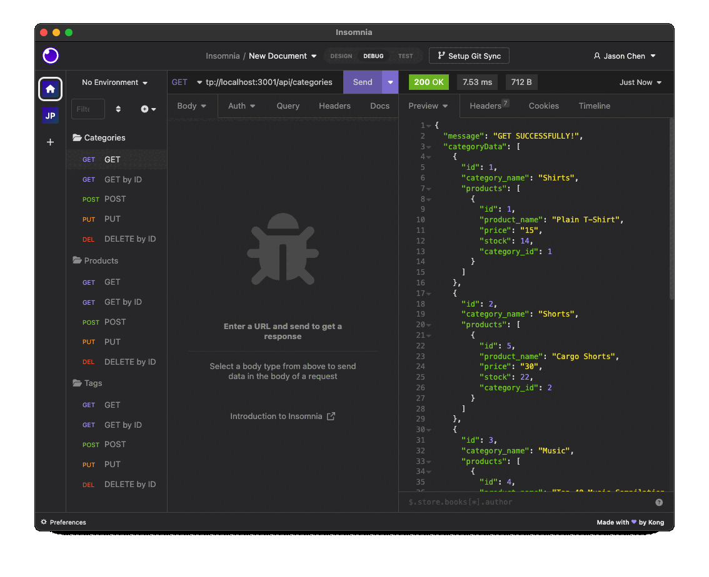
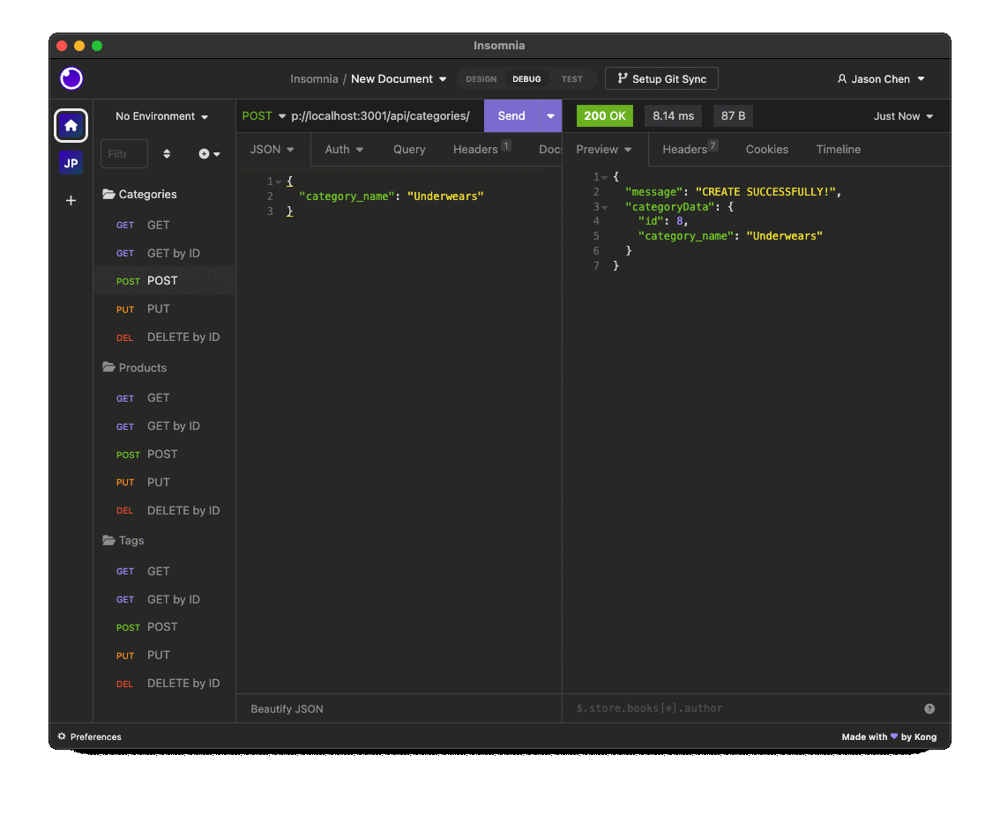

# E-Commerce-Back-End

## Table of Contents

- [Description](#description)
- [Installation](#installation)
- [Usage](#usage)
- [Question](#question)

## Description

It's a powerful application for controlling with Node.js and SQL. It's easy to edit your database, and maintain your database. This application will use Express.js API and configure ti use Sequelize to interact with a MySQL database.

## Installation

Clone the project:

`git@github.com:Jasonccfu/e-commerce-back-end.git`

Install pakages:

`npm install` (including Express, MySQL2, Sequelize and dotenv).

Enter your MySQL:

`mysql -u root -p`

`source` the `schema.sql` in `db` folder.

`npm run seed` To seed your database

Creat `.env` file in the project
,

Example :

```
DB_NAME='ecommerce_db'
DB_USER='root'
DB_PASSWORD=''
```

`npm start` To start the application.

## Usage

Check how to use by [Walkthrough Video](https://watch.screencastify.com/v/3ZdEwAZNHEkSIl0crRjO).

GET and GET by ID routes to return all categories, all products, and all tags being tested in Insomnia Core:



POST, PUT, and DELETE routes for categories being tested in Insomnia Core:



## License

[](https://shields.io)

## Questions

If you have any questions about this projects, please contact me directly at jason.ccfu@gmail.com. You can also view more of my projects at https://github.com/Jasonccfu.
